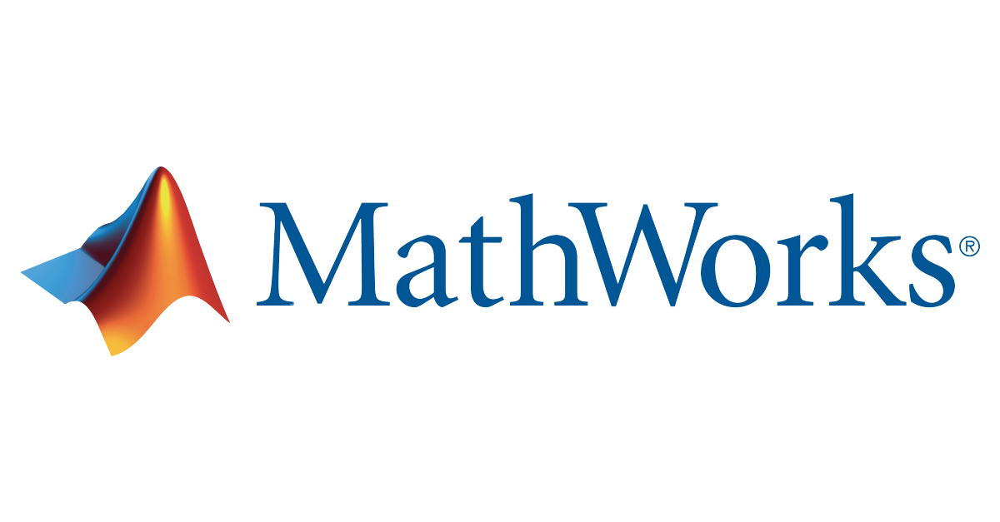

<link rel="stylesheet" href="https://cdn.jsdelivr.net/npm/bootstrap-icons@1.5.0/font/bootstrap-icons.css">
<link rel="stylesheet" href="../source.css">

</img>

<h1 style="text-align:center; color:#07a9e9">Matlab Documents </h1>

---

Millions of engineers and scientists worldwide use MATLAB® to analyze and design the systems and products transforming our world. The matrix-based MATLAB language is the world’s most natural way to express computational mathematics. Built-in graphics make it easy to visualize and gain insights from data. The desktop environment invites experimentation, exploration, and discovery. These MATLAB tools and capabilities are all rigorously tested and designed to work together.

MATLAB helps you take your ideas beyond the desktop. You can run your analyses on larger data sets, and scale up to clusters and clouds. MATLAB code can be integrated with other languages, enabling you to deploy algorithms and applications within web, enterprise, and production systems.

